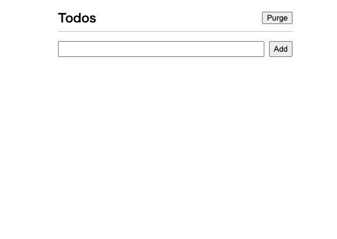
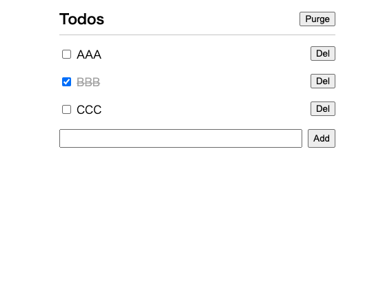
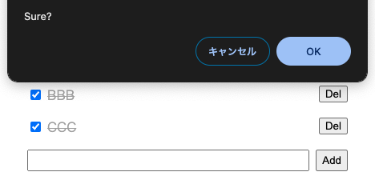

# portfolio_JavaScript    

## ■ URL
GitHub Pagesのリンクです． 
https://gucchi612.github.io/portfolio_JavaScript/

## ■ 概要
Reactの学習をし，アウトプットとして簡単な**ToDo管理アプリ**を作成した．

## ■ 目的
JavaScript, Reactで開発を行えるようにするため．学習した内容をアウトプットするため．

## ■ 仕様（操作方法）
|シーン|説明|
|:---:|---|
|**メイン画面** |ページを開いた際に最初に表示される画面． テキストボックスにToDoタスクを入力し，"Add"ボタンを押下することでタスクを追加． |
|**ToDoタスクを入力した状態** |各タスクの左のチェックボックスを押下することで，タスクを完了できる． 各タスクの"Del"ボタンを押下すると，そのタスクを削除できる． 任意の終了タスクがチェックされた状態で，画面右上の"Purge"ボタンを押下すると"Sure?"のメッセージと共にポップアップが表示され，"OK"を押すことで，完了タスクを一括削除できる．|
|**完了タスクの一括削除** |"Purge"ボタン押下後のポップアップ画面．|

## 使用技術
* React

## 今後の学習方針
1. Reactの学習をさらに進め，より高機能なアプリの開発に挑む．
2. 今回のToDo管理アプリの機能追加
    * ToDoタスクの優先度
    * タグ付けによるグルーピング機能
    * タスク完了にかかった時間計測・記録機能
    * カレンダー機能
3. TypeScript, Next.jsの学習，開発